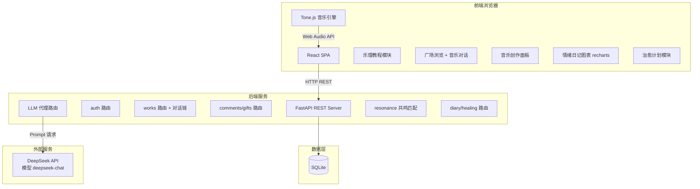

## 产品概述

「失恋广场」是一个以音乐为情感纽带的网页社区平台。用户在这里学习基础乐理知识，结合 DeepSeek AI + Tone.js 免费创作能表达心情的音乐，并在广场中通过"音乐对话"与他人互动——用音乐回复他人的情绪，AI 帮你匹配情绪共鸣的陌生人，参与治愈计划记录情绪成长轨迹。所有功能完全免费，用音乐连接每一颗需要被听见的心。

## 核心功能

### 1. 乐理学习

内置阶梯式乐理教程，涵盖音阶入门、和弦基础、节奏感知、情绪映射四大章节。每节课含图文讲解、交互式试听（点击即可听音阶/和弦实际音响效果），章末小测验巩固。

### 2. AI 辅助音乐创作

用户输入情绪描述文字（如"雨天的思念，淡淡的忧伤但又有一丝希望"），DeepSeek API（模型 deepseek-chat，API Key: sk-7010e5b6517c485886b3422c6b6cc6c3）自动解析出音乐参数——调式、和弦进行、速度、节奏型、乐器推荐。前端 Tone.js 浏览器端即时合成播放，用户可手动调节每个参数。

### 3. 广场社区 + 音乐对话

作品卡片流展示，最新/热门双维度排序，情绪标签快捷筛选。核心社交机制：**音乐对话**——用户可对任意作品发起"音乐回复"（用自己创作的一段音乐回应），形成音乐对话链。支持评论、点赞、收藏、赠送虚拟礼物。

### 4. 情绪共鸣匹配

AI 分析用户作品的音乐参数和情绪标签，自动推荐情绪频率相近的陌生人作品。用户在"共鸣"页面浏览和自己"同频"的音乐。

### 5. 情绪成长日记

每次创作自动记录情绪状态（情绪标签 + 1-10 情绪强度评分），recharts 折线图可视化"情绪成长曲线"，可翻看心路历程。

### 6. 治愈计划

预设三种免费疗愈计划：7天"温柔重启" / 14天"愈合之旅" / 30天"新生之路"，每种包含每日音乐创作任务，完成后获得成就徽章。

### 7. 虚拟礼物（全免费）

可向有共鸣的作品赠送花束、暖灯、星光、纸飞机、拥抱等虚拟礼物，增加作品温暖指数。

### 8. 用户系统

注册/登录、个人主页（展示作品、收藏、收到的礼物、完成的治愈计划、情绪日记时间线）。

## 技术栈

| 层级 | 技术 | 版本/说明 |
| --- | --- | --- |
| 前端框架 | React + TypeScript | React 18，Vite 5 构建 |
| UI 样式 | TailwindCSS + shadcn/ui | TailwindCSS 3.4.17，shadcn/ui 组件库 |
| 图表库 | recharts | 情绪曲线可视化 |
| 音乐合成 | Tone.js | 浏览器端 Web Audio API，零服务器音频负载 |
| 后端框架 | Python FastAPI | 异步高性能 REST API |
| 数据库 | SQLite + SQLAlchemy | 轻量零配置，ORM |
| 认证 | JWT (python-jose) | 无状态 Token，24h 过期 |
| AI 服务 | DeepSeek API | 模型 deepseek-chat，API 地址 https://api.deepseek.com/v1/chat/completions |
| AI API Key | sk-7010e5b6517c485886b3422c6b6cc6c3 | 仅存后端环境变量 |


## 实现方案

### 音乐生成链路（核心管线）

```
用户输入情绪文字
       │
       ▼
┌─────────────────────────────────┐
│  后端 POST /api/llm/generate-params │──▶ DeepSeek Prompt Template
│  API: https://api.deepseek.com      │   要求严格 JSON 输出
│  Model: deepseek-chat               │
│  Key: sk-7010e5b6517c485886b3422c6b6cc6c3 │
│  返回结构化音乐参数 JSON              │
└─────────────┬───────────────────┘
              │
              ▼
  { scale: "D_minor", tempo: 72,
    chord_progression: ["Dm7","Gm7","C7","Fmaj7"],
    rhythm_style: "flowing_arpeggio",
    melody_contour: "descending_gentle",
    instrument: "piano", mood: "melancholic" }
              │
              ▼
┌─────────────────────────────────┐
│  前端 Tone.js MusicEngine        │
│  PolySynth + Reverb + Delay     │
│  浏览器实时合成音频               │
└─────────────┬───────────────────┘
              │
              ▼
    用户试听 → 手动微调参数 → 保存作品(JSON)
```

### 数据模型（新增）

**音乐对话**：MusicWork 新增 `reply_to_work_id` 字段（可为 NULL），形成对话链。前端渲染时递归展示对话树。

**情绪日记**：新增 EmotionDiary 模型（id, user_id, mood_tag, mood_score 1-10, note, work_id, created_at）。

**治愈计划**：新增 HealingPlan 模型（id, name, description, duration_days, tasks_json）和 UserHealingPlan（id, user_id, plan_id, current_day, start_date, completed_tasks_json）。

**虚拟礼物**：新增 Gift 模型（id, name, icon, type）和 WorkGift（id, work_id, sender_id, gift_id, created_at）。

### 系统架构图



## 实现注意事项

### 性能优化

- Tone.js 合成使用 requestAnimationFrame 调度
- 广场列表 cursor-based 分页，前端懒加载
- LLM 调用本地缓存（情绪+参数 hash 命中返回）
- SQLite 复合索引 (mood_tag, created_at) + (likes_count, created_at) + (reply_to_work_id)

### 安全性

- JWT token 24h 过期，secret key 环境变量注入
- DeepSeek API Key 仅存后端 .env 文件，前端不可见
- Pydantic 校验所有输入
- CORS 配置限定前端域名

### DeepSeek API 配置

- Base URL: https://api.deepseek.com/v1/chat/completions
- Model: deepseek-chat
- API Key: sk-7010e5b6517c485886b3422c6b6cc6c3
- Prompt 设计为严格 JSON 输出，限定音域范围、和弦库、节奏型枚举

## 目录结构

```
/home/taoyy/music_ai/
├── frontend/                          # React 前端工程
│   ├── package.json                   # react, react-dom, react-router-dom, axios, tone, recharts, tailwindcss, lucide-react, shadcn/ui
│   ├── vite.config.ts                 # host: '0.0.0.0', proxy /api → 后端
│   ├── tailwind.config.ts             # 暖色主题自定义
│   ├── tsconfig.json / tsconfig.app.json
│   ├── postcss.config.js
│   ├── index.html
│   └── src/
│       ├── main.tsx                   # 入口
│       ├── App.tsx                    # 路由：/ /square /create /theory /login /profile /work/:id /resonance /diary /healing
│       ├── index.css                  # Tailwind 指令
│       ├── lib/
│       │   ├── utils.ts               # 工具函数
│       │   └── api.ts                 # Axios 实例 + 拦截器
│       ├── types/
│       │   └── index.ts               # MusicParams, MusicWork, User, Comment, EmotionDiary, HealingPlan, Gift, WorkGift
│       ├── hooks/
│       │   ├── useAuth.ts             # 认证 Hook
│       │   └── useMusicPlayer.ts      # Tone.js 播放 Hook
│       ├── services/
│       │   ├── authService.ts
│       │   ├── workService.ts
│       │   ├── llmService.ts          # DeepSeek 参数生成
│       │   ├── diaryService.ts        # 情绪日记 API
│       │   ├── healingService.ts      # 治愈计划 API
│       │   ├── giftService.ts         # 虚拟礼物 API
│       │   └── resonanceService.ts    # 共鸣匹配 API
│       ├── engine/
│       │   └── toneEngine.ts          # Tone.js 核心引擎
│       ├── data/
│       │   ├── theoryData.ts          # 乐理课程数据
│       │   ├── healingData.ts         # 治愈计划预设数据
│       │   └── giftData.ts            # 礼物预设数据
│       ├── components/
│       │   ├── ui/                    # shadcn/ui 组件
│       │   ├── layout/
│       │   │   ├── Navbar.tsx         # 顶部导航
│       │   │   └── Layout.tsx         # 全局布局
│       │   ├── auth/
│       │   │   ├── LoginForm.tsx
│       │   │   └── RegisterForm.tsx
│       │   ├── theory/
│       │   │   ├── TheoryChapter.tsx
│       │   │   └── ScalePlayer.tsx    # 音阶/和弦播放
│       │   ├── create/
│       │   │   ├── EmotionInput.tsx   # 情绪输入
│       │   │   ├── ParamPanel.tsx     # 参数面板
│       │   │   └── MusicPlayer.tsx    # 播放控制条
│       │   ├── square/
│       │   │   ├── PostCard.tsx       # 作品卡片
│       │   │   ├── CommentSection.tsx # 评论区
│       │   │   ├── EmotionTag.tsx     # 情绪标签
│       │   │   ├── DialogChain.tsx    # 音乐对话链视图
│       │   │   └── GiftButton.tsx     # 礼物赠送按钮
│       │   ├── diary/
│       │   │   └── EmotionChart.tsx   # recharts 情绪曲线
│       │   └── healing/
│       │       ├── PlanCard.tsx       # 治愈计划卡片
│       │       └── TaskItem.tsx       # 每日任务项
│       └── pages/
│           ├── HomePage.tsx           # 首页
│           ├── SquarePage.tsx         # 广场
│           ├── CreatePage.tsx         # 创作页（支持 reply 模式）
│           ├── TheoryPage.tsx         # 乐理学习
│           ├── LoginPage.tsx          # 登录注册
│           ├── ProfilePage.tsx        # 个人主页
│           ├── WorkDetailPage.tsx     # 作品详情 + 对话链
│           ├── ResonancePage.tsx      # 情绪共鸣
│           ├── DiaryPage.tsx          # 情绪日记
│           └── HealingPage.tsx        # 治愈计划
│
├── backend/                           # Python FastAPI 后端
│   ├── requirements.txt               # fastapi, uvicorn, sqlalchemy, python-jose, httpx, pydantic, python-dotenv
│   ├── .env                           # DEEPSEEK_API_KEY=sk-7010e5b6517c485886b3422c6b6cc6c3, JWT_SECRET, DATABASE_URL
│   ├── app/
│   │   ├── main.py                    # FastAPI 入口，CORS，路由注册
│   │   ├── config.py                  # 环境变量加载
│   │   ├── database.py                # SQLAlchemy 引擎 + Session
│   │   ├── models/
│   │   │   ├── __init__.py
│   │   │   ├── user.py                # User 模型
│   │   │   ├── music_work.py          # MusicWork 模型（含 reply_to_work_id）
│   │   │   ├── comment.py             # Comment 模型
│   │   │   ├── emotion_diary.py       # EmotionDiary 模型
│   │   │   ├── healing_plan.py        # HealingPlan + UserHealingPlan
│   │   │   └── gift.py                # Gift + WorkGift
│   │   ├── schemas/
│   │   │   ├── __init__.py
│   │   │   ├── user.py
│   │   │   ├── music_work.py
│   │   │   ├── llm.py
│   │   │   ├── diary.py
│   │   │   ├── healing.py
│   │   │   └── gift.py
│   │   ├── routers/
│   │   │   ├── __init__.py
│   │   │   ├── auth.py                # /api/auth/*
│   │   │   ├── works.py               # /api/works/*
│   │   │   ├── comments.py            # /api/works/:id/comments
│   │   │   ├── llm.py                 # /api/llm/generate-params
│   │   │   ├── diary.py               # /api/diary/*
│   │   │   ├── healing.py             # /api/healing/*
│   │   │   ├── gifts.py               # /api/gifts/* /api/works/:id/gifts
│   │   │   └── resonance.py           # /api/resonance/match
│   │   ├── services/
│   │   │   ├── __init__.py
│   │   │   ├── auth_service.py
│   │   │   ├── work_service.py
│   │   │   ├── llm_service.py         # DeepSeek API 调用 + Prompt 模板
│   │   │   ├── diary_service.py
│   │   │   ├── healing_service.py
│   │   │   ├── gift_service.py
│   │   │   └── resonance_service.py   # 情绪共鸣算法
│   │   └── middleware/
│   │       ├── __init__.py
│   │       └── auth.py                # JWT 依赖注入
│   └── init_db.py                     # 建表 + 初始化治愈计划/礼物数据
│
└── README.md                          # 启动指南
```

## 关键代码结构

### 音乐参数接口（前后端共享协议）

```typescript
interface MusicParams {
  scale: string;
  tempo: number;
  chord_progression: string[];
  rhythm_style: string;
  melody_contour: string;
  instrument: string;
  mood: string;
}
```

### 核心 API 端点

| 端点 | 方法 | 说明 |
| --- | --- | --- |
| /api/auth/register | POST | 注册 |
| /api/auth/login | POST | 登录 |
| /api/works | GET/POST | 作品列表（分页/排序/筛选）/ 发布作品 |
| /api/works/:id | GET | 作品详情（含对话链） |
| /api/works/:id/reply | POST | 音乐回复 |
| /api/works/:id/like | POST | 点赞 |
| /api/works/:id/comments | GET/POST | 评论列表 / 发表评论 |
| /api/works/:id/gifts | GET/POST | 礼物列表 / 赠送礼物 |
| /api/llm/generate-params | POST | DeepSeek 生成音乐参数 |
| /api/resonance/match | POST | 情绪共鸣匹配 |
| /api/diary | GET/POST | 情绪日记列表 / 记录情绪 |
| /api/diary/chart | GET | 情绪曲线数据 |
| /api/healing/plans | GET | 所有治愈计划 |
| /api/healing/start | POST | 开始一个计划 |
| /api/healing/my | GET | 我的计划进度 |
| /api/healing/tasks/:id/complete | POST | 完成当日任务 |
| /api/gifts | GET | 所有礼物类型 |


## 设计风格：温暖治愈风

整体采用柔和暖色调搭配毛玻璃质感，营造安全、柔软、被包容的情绪空间。设计灵感源自日落时分的暖光、冬日毛毯的触感、旧式音乐盒的怀旧氛围。

### 色彩体系

- 主色调：珊瑚暖橙 #E8916A
- 辅助色：玫瑰粉 #F0C6C0、奶油黄 #FFF3E0
- 背景渐变：奶油白到浅桃色
- 毛玻璃面板：半透明白底 + backdrop-blur(12px)

### 页面规划（10个核心页面）

**1. 首页 HomePage**
顶部大标题"失恋广场"+"在这里，每一种情绪都值得被听见"，背景渐变暖色。中部三张毛玻璃引导卡片（悬浮微动效）：学乐理/去创作/逛广场。底部随机展示3首热门作品。右上角放置"治愈计划"入口。

**2. 广场页 SquarePage**
顶部切换栏"最新"/"热门"，下方情绪标签快捷筛选（#忧伤 #思念 #治愈 #希望 #愤怒 #平静）。作品卡片流：左侧情绪色彩渐变条，主体含标题、作者头像、播放按钮、点赞评论数、虚拟礼物数。点击进入详情。浮动按钮"发布我的音乐"。

**3. 创作页 CreatePage**
上半部分：大文本区输入情绪描述（placeholder："写下你的心情，AI 帮你谱成曲..."），"AI 解析"按钮带加载动画（音符飘散动效）。中部：音乐参数面板，和弦进行以彩色圆饼展示，速度圆环滑块，乐器图标切换（钢琴/吉他/弦乐/钟琴）。底部：播放控制条（实时波形可视化）+ "发布到广场"按钮。支持 reply 模式（顶部显示"回应 @某某某的《作品名》"）。

**4. 乐理页 TheoryPage**
左侧章节树导航（音阶→和弦→节奏→情绪映射）。右侧内容区图文排版，内嵌可交互 ScalePlayer 播放按钮（点击即听示例）。章末选择题小测验，答对有微动效反馈。

**5. 作品详情页 WorkDetailPage**
顶部原作品卡片（大尺寸播放器）。下方"音乐对话链"——树形展示所有回复，可展开/收起。每层对话显示用户头像+音乐播放+简短文字。底部可"用音乐回应"跳转创作页。评论区和礼物区。

**6. 情绪共鸣页 ResonancePage**
顶部说明"AI 找到这些和你同频的音乐..."。卡片列表，每张标注"情绪匹配度 89%"，播放按钮+作者信息。可送礼物或发起音乐对话。

**7. 情绪日记页 DiaryPage**
顶部 recharts 情绪曲线图（横轴=日期，纵轴=情绪评分 1-10，不同颜色折线代表不同情绪标签）。下方时间线列表，每条记录显示日期、情绪标签、情绪评分、关联作品链接。

**8. 治愈计划页 HealingPage**
三张计划卡片（7天/14天/30天），展示名称、描述、已加入人数。点击进入详情：每日任务清单，已完成任务打勾动效，进度条。全部完成后获得成就徽章弹窗。

**9. 登录页 LoginPage**
居中卡片，暖色渐变背景。注册/登录切换 Tab。表单简洁：用户名+密码。登录后跳转广场。

**10. 个人主页 ProfilePage**
头像+用户名+加入天数。Tab 切换：我的作品 / 我的收藏 / 收到的礼物 / 治愈计划 / 情绪日记。作品列表含编辑/删除按钮。

### 交互动效

- 页面切换 fade + 轻微上移
- 卡片悬浮微上浮 + 阴影加深
- 播放时波形跳动动画
- 点赞心形缩放弹跳
- 礼物送出飘落动画
- AI 解析中音符旋转加载
- 任务完成打勾放大动效

## Agent Extensions

### SubAgent

- **code-explorer**
- 用途：在搭建过程中批量搜索 Tone.js 文档示例、shadcn/ui 组件 API 签名、DeepSeek API 官方文档参考
- 预期结果：获取准确的 Tone.js 合成器配置参数、shadcn 组件导入方式和 Props 类型，确保代码编写正确

### Skill

- **多模态内容生成**
- 用途：生成首页情绪氛围背景图、乐理教程配图、虚拟礼物图标等视觉素材
- 预期结果：产出温暖治愈风格的配图和图标资源