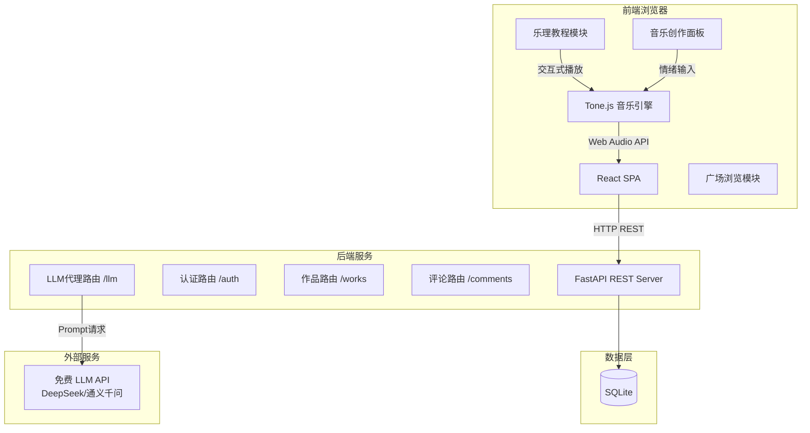

## 产品概述

「失恋广场」是一个以音乐为情感纽带的网页社区平台。用户在这里学习基础乐理知识，结合 AI 辅助创作能表达心情的音乐，并在广场中发布、分享、聆听他人的作品，通过音乐实现情绪的抒发与人与人之间的共鸣。整个应用以"温暖疗愈"为基调，强调音乐作为一种无声却有力的表达方式。

## 核心功能

### 1. 乐理学习

内置阶梯式乐理教程模块，涵盖音阶、和弦、节奏、情绪映射等主题。每节课包含图文讲解、交互式示例（点击即可听到音阶/和弦的实际音响效果），以及小测验帮助巩固。学完即可在创作区实践所学内容。

### 2. AI 辅助音乐创作

用户输入一段情绪描述文字（如"雨天的思念，淡淡的忧伤但又有一丝希望"），AI 自动解析出对应的音乐参数——调式音阶、和弦进行、速度、节奏型、旋律走向、推荐乐器。前端 Tone.js 引擎即时合成播放，用户可以手动调节每个参数（更换和弦、调整速度、修改旋律），像搭积木一样用乐理知识创作音乐。

### 3. 广场社区

音乐作品以卡片流形式展示在广场中。每张卡片展示作品的情绪标签（如#忧伤 #治愈 #希望）、播放按钮、作者头像。用户可收听、评论、点赞、收藏。广场按"最新"和"热门"两个维度排序，营造真实社区氛围。

### 4. 用户系统

注册/登录、个人主页（展示发布过的作品和收藏）、情绪日记（用户创作历程的时间线）。

## 技术栈

| 层级 | 技术 | 说明 |
| --- | --- | --- |
| 前端框架 | React 18 + TypeScript | Vite 构建，组件化开发 |
| UI 样式 | TailwindCSS + shadcn/ui | 原子化CSS + 高质量组件库 |
| 音乐合成 | Tone.js | 浏览器端 Web Audio API 封装，零服务器音频负载 |
| 后端框架 | Python FastAPI | 异步高性能，自动生成 API 文档 |
| 数据库 | SQLite + SQLAlchemy | 轻量零配置，ORM 操作 |
| 认证 | JWT (python-jose) | 无状态 Token 认证 |
| AI 接口 | 免费 LLM API (DeepSeek / 通义千问) | 后端代理转发 |


## 实现方案

### 音乐生成管线（核心链路）

```
用户输入情绪文字
       │
       ▼
┌─────────────────────────────┐
│  后端 POST /api/llm/params  │──▶ 精心设计的 Prompt Template
│  发送给免费 LLM API          │   要求返回 JSON 格式的音乐参数
│  返回结构化音乐参数 JSON      │
└─────────────┬───────────────┘
              │
              ▼
  { scale: "D_minor", tempo: 72,
    chord_progression: ["Dm7","Gm7","C7","Fmaj7"],
    rhythm_style: "flowing_arpeggio",
    melody_contour: "descending_gentle",
    instrument: "piano", mood: "melancholic" }
              │
              ▼
┌─────────────────────────────┐
│  前端 Tone.js MusicEngine    │
│  ├─ PolySynth 渲染和弦背景   │
│  ├─ MonoSynth 演奏旋律线     │
│  ├─ Transport 控制节奏/速度   │
│  └─ 实时参数面板可手动调节    │
└─────────────┬───────────────┘
              │
              ▼
    用户试听 → 微调参数 → 满意后保存作品(MIDI级参数JSON)
```

**关键技术决策**：

- 音乐作品存储为参数 JSON（非音频文件），播放时由 Tone.js 实时合成。这样数据库轻量，且用户二次编辑无需重新生成音频。
- Tone.js 使用 `PolySynth` + 自定义音色调校（attack/release/volume envelope），配合 `Reverb` 和 `Delay` 效果器营造空间感和氛围感。
- LLM prompt 设计为严格 JSON 输出模式，限定音域范围、和弦库、节奏型枚举，确保生成参数始终能被 Tone.js 正确渲染。

### 数据流

```
┌──────────┐    HTTP/JSON    ┌──────────────┐    SQL     ┌────────┐
│  React   │ ◄──────────────▶│  FastAPI      │◄─────────▶│ SQLite │
│  前端    │   REST API      │  后端服务      │  ORM      │  数据库  │
└──────────┘                 └──────┬───────┘           └────────┘
      │                             │
      │  Tone.js 浏览器合成          │  HTTP 转发
      │  (零服务端音频负载)           │  LLM API
      ▼                             ▼
  用户浏览器音频输出            DeepSeek / 通义千问
```

## 实现注意事项

### 性能优化

- Tone.js 合成使用 `requestAnimationFrame` 调度，避免阻塞 UI 线程
- 广场列表分页加载（后端 cursor-based pagination），前端虚拟滚动
- LLM 调用增加本地缓存（相同情绪+参数 hash 命中时直接返回），减少 API 调用
- SQLite 对作品列表的查询加上复合索引 (mood_tag, created_at) 和 (likes_count, created_at)

### 安全性

- 所有用户输入经过 FastAPI Pydantic 校验
- JWT token 设置合理过期时间（24h），secret key 环境变量注入
- LLM API Key 仅存后端环境变量，前端不可见
- CORS 配置限定前端域名

### 日志

- FastAPI 使用标准 logging，关键操作（注册、发布作品、LLM 调用）记录 info 级别日志
- 错误日志包含 traceback，便于排查

## 架构设计

### 系统架构图



### 模块划分

| 模块 | 职责 | 关键文件 |
| --- | --- | --- |
| 前端布局 | 全局导航、路由、主题 | Layout.tsx, App.tsx |
| 乐理学习 | 课程内容渲染、交互示例 | TheoryPage.tsx, theoryData.ts |
| 音乐创作 | Tone.js 引擎、参数面板 | MusicCreator.tsx, toneEngine.ts |
| 广场社区 | 作品流、评论、点赞 | SquarePage.tsx, PostCard.tsx |
| 用户系统 | 登录注册、个人主页 | LoginPage.tsx, ProfilePage.tsx |
| 后端认证 | JWT签发与校验 | auth.py, auth_service.py |
| 后端作品 | CRUD、分页、模糊搜索 | works.py, work_service.py |
| 后端 LLM | 代理转发、prompt模板 | llm_service.py |
| 数据模型 | User, MusicWork, Comment | models/*.py |


## 目录结构

```
/home/taoyy/music_ai/
├── frontend/                          # React 前端工程
│   ├── package.json                   # 依赖：react, tone, tailwindcss, shadcn/ui, axios, react-router-dom, lucide-react
│   ├── vite.config.ts                 # Vite配置，含代理转发 /api → 后端
│   ├── tailwind.config.ts             # TailwindCSS配置，自定义暖色主题
│   ├── tsconfig.json
│   ├── index.html
│   └── src/
│       ├── main.tsx                   # 应用入口
│       ├── App.tsx                    # 路由配置（首页/广场/创作/乐理/登录/个人）
│       ├── index.css                  # 全局样式 + Tailwind指令
│       ├── lib/
│       │   ├── utils.ts               # 通用工具函数
│       │   └── api.ts                 # Axios实例 + API封装函数
│       ├── types/
│       │   └── index.ts               # 全局类型定义：MusicParams, MusicWork, User, Comment
│       ├── hooks/
│       │   ├── useAuth.ts             # 认证状态Hook（登录/登出/Token管理）
│       │   └── useMusicPlayer.ts      # Tone.js播放控制Hook
│       ├── services/
│       │   ├── authService.ts         # 登录注册API调用
│       │   ├── workService.ts         # 作品CRUD API调用
│       │   └── llmService.ts          # LLM参数生成API调用
│       ├── engine/
│       │   └── toneEngine.ts          # Tone.js 核心引擎：根据MusicParams合成播放/停止/调节
│       ├── data/
│       │   └── theoryData.ts          # 乐理课程数据：章节、内容、交互参数
│       ├── components/
│       │   ├── ui/                    # shadcn/ui 组件（Button, Card, Input, Dialog等）
│       │   ├── layout/
│       │   │   ├── Navbar.tsx         # 顶部导航栏（Logo + 导航链接 + 用户头像）
│       │   │   └── Layout.tsx         # 全局布局容器
│       │   ├── auth/
│       │   │   ├── LoginForm.tsx      # 登录表单
│       │   │   └── RegisterForm.tsx   # 注册表单
│       │   ├── theory/
│       │   │   ├── TheoryChapter.tsx  # 单个乐理章节渲染（图文+播放按钮）
│       │   │   └── ScalePlayer.tsx    # 音阶/和弦交互播放组件
│       │   ├── create/
│       │   │   ├── EmotionInput.tsx   # 情绪描述输入区
│       │   │   ├── ParamPanel.tsx     # 音乐参数调节面板（和弦/速度/音色）
│       │   │   └── MusicPlayer.tsx    # 播放/暂停/停止控制条
│       │   └── square/
│       │       ├── PostCard.tsx       # 广场作品卡片（封面/情绪标签/播放/操作）
│       │       ├── CommentSection.tsx # 评论区组件
│       │       └── EmotionTag.tsx     # 情绪标签组件
│       └── pages/
│           ├── HomePage.tsx           # 首页（欢迎语 + 快速入口：学乐理/去创作/逛广场）
│           ├── SquarePage.tsx         # 广场页（作品流 + 排序切换）
│           ├── CreatePage.tsx         # 创作页（情绪输入 → 参数调节 → 发布）
│           ├── TheoryPage.tsx         # 乐理学习页（章节列表 + 内容 + 测验）
│           ├── LoginPage.tsx          # 登录/注册页
│           └── ProfilePage.tsx        # 个人主页（我的作品 + 收藏）
│
├── backend/                           # Python FastAPI 后端
│   ├── requirements.txt               # fastapi, uvicorn, sqlalchemy, python-jose, httpx, pydantic
│   ├── app/
│   │   ├── main.py                    # FastAPI 应用入口，CORS配置，路由注册
│   │   ├── config.py                  # 环境变量配置（DB路径, JWT_SECRET, LLM_API_KEY, LLM_BASE_URL）
│   │   ├── database.py                # SQLAlchemy 引擎 + SessionLocal + Base
│   │   ├── models/
│   │   │   ├── user.py                # User 模型（id, username, password_hash, avatar, created_at）
│   │   │   ├── music_work.py          # MusicWork 模型（id, user_id, title, mood_tag, params_json, is_public, likes_count, created_at）
│   │   │   └── comment.py             # Comment 模型（id, work_id, user_id, content, created_at）
│   │   ├── schemas/
│   │   │   ├── user.py                # UserCreate, UserLogin, UserResponse, TokenResponse
│   │   │   ├── music_work.py          # WorkCreate, WorkResponse, WorkListResponse
│   │   │   └── llm.py                 # EmotionInput, MusicParamsResponse
│   │   ├── routers/
│   │   │   ├── auth.py                # POST /api/auth/register, POST /api/auth/login
│   │   │   ├── works.py               # GET/POST /api/works, GET /api/works/:id, POST /api/works/:id/like
│   │   │   ├── comments.py            # GET/POST /api/works/:id/comments
│   │   │   └── llm.py                 # POST /api/llm/generate-params（LLM代理端点）
│   │   ├── services/
│   │   │   ├── auth_service.py        # 密码哈希、JWT签发/验证、用户查询
│   │   │   ├── work_service.py        # 作品CRUD、分页、排序、搜索
│   │   │   └── llm_service.py         # LLM API调用、Prompt模板、参数校验
│   │   └── middleware/
│   │       └── auth.py                # JWT依赖注入（get_current_user）
│   └── init_db.py                     # 首次运行建表脚本
│
└── README.md                          # 项目说明 + 启动指南
```

## 关键代码结构

### 音乐参数接口（前后端共享协议）

```typescript
// frontend/src/types/index.ts
interface MusicParams {
  scale: string;              // 调式音阶，如 "D_minor", "C_major", "F_dorian"
  tempo: number;              // 速度 BPM，范围 40-180
  chord_progression: string[];// 和弦进行，如 ["Dm7","Gm7","C7","Fmaj7"]
  rhythm_style: string;       // 节奏型，如 "flowing_arpeggio", "gentle_broken_chord", "steady_waltz"
  melody_contour: string;     // 旋律走向，如 "descending_gentle", "ascending_hopeful"
  instrument: string;         // 乐器，如 "piano", "guitar", "strings"
  mood: string;               // 情绪标签，如 "melancholic", "hopeful", "calm"
}
```

### Tone.js 引擎核心签名

```typescript
// frontend/src/engine/toneEngine.ts
class ToneMusicEngine {
  init(): Promise<void>;                          // 初始化AudioContext + 合成器
  loadParams(params: MusicParams): void;           // 加载音乐参数
  play(): void;                                    // 开始播放
  stop(): void;                                    // 停止
  setTempo(bpm: number): void;                     // 实时调速
  updateChord(index: number, chord: string): void;  // 实时换和弦
  dispose(): void;                                 // 释放资源
}
```

## 设计风格

### 主题定位：温暖治愈风

整体采用柔和暖色调搭配毛玻璃质感，营造安全、柔软、被包容的情绪空间。设计灵感源自日落时分的暖光、冬日毛毯的触感、以及旧式音乐盒的怀旧氛围。

### 色彩体系

- **主色调**：珊瑚暖橙（#E8916A）传递温度与亲近感
- **辅助色**：玫瑰粉（#F0C6C0）、奶油黄（#FFF3E0）提亮页面层次
- **背景渐变**：奶油白到浅桃色，如晨曦微光
- **毛玻璃面板**：半透明白底 + backdrop-blur，营造柔和层次

### 页面结构（5个核心页面）

**1. 首页（HomePage）**

- 顶部：大标题"失恋广场"+"在这里，每一种情绪都值得被听见"
- 中部三张引导卡片（毛玻璃质感，悬浮微动效）："学乐理" / "去创作" / "逛广场"
- 底部：随机展示 3 首广场热门作品卡片

**2. 广场页（SquarePage）**

- 顶部切换栏："最新" / "热门"，下方情绪标签快捷筛选
- 瀑布流作品卡片：左侧渐变色条表示情绪类型，卡片主体展示标题、作者、播放按钮、点赞评论数
- 点击卡片展开评论区

**3. 创作页（CreatePage）**

- 上半部分：大文本区输入情绪描述，下方"AI 解析"按钮（带加载动画）
- 中部：音乐参数面板（和弦进行以彩色圆饼图展示，速度用圆环滑块，乐器可切换图标）
- 底部：播放控制条（波形可视化）+ "发布到广场"按钮

**4. 乐理页（TheoryPage）**

- 左侧章节树状导航（音阶 → 和弦 → 节奏 → 情绪映射）
- 右侧内容区：图文排版 + 内嵌可交互播放按钮（点击即听示例）
- 章末小测验：选择题形式，答对有微动效反馈

**5. 登录/个人页**

- 登录页：居中卡片，暖色渐变背景
- 个人页：头像 + 作品时间线 + 收藏列表

### 交互动效

- 页面切换柔滑过渡（fade + 轻微上移）
- 卡片悬浮微上浮 + 阴影加深
- 播放时波形跳动动画
- 点赞心形缩放弹跳动效

## Agent Extensions

### SubAgent

- **code-explorer**
- 用途：在项目搭建过程中，用于批量搜索和检查 Tone.js 文档示例、shadcn/ui 组件用法等参考资源
- 预期结果：获取准确的 API 签名和组件使用方式，确保代码编写正确